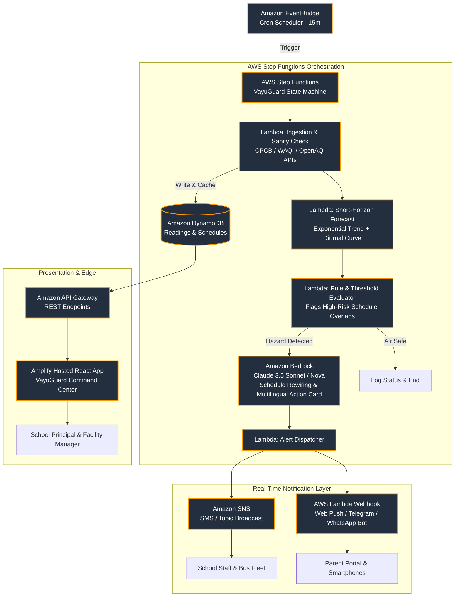

# Environmental Hacks 2026 — 10/10 Hackathon Winning Blueprint

**Project Name:** **VayuGuard (formerly AirCue)**  
**Tagline:** *"Turning toxic AQI numbers into automated, proactive school safety decisions before the first bell rings."*  
**Track:** Air (Air Quality, Exposure Reduction, School Safety, Proactive Health)  
**Target:** 1st Place Track Winner (₹2,00,000 + $2,000 AWS Credits + Amazon Fast-Track Interviews)

---

## Executive Summary & The "Why We Win" Thesis

Most hackathon air-quality projects build **passive dashboards**—they fetch an AQI number (e.g. `AQI 342: Severe`), plot a red line chart, and stop. In real life, raw numbers don't protect anyone. A school principal facing morning smog in Delhi/North India doesn't need to know the air is toxic; they already know that. **They need to know exactly what to do with their 8-period timetable right now to protect 1,000+ kids.**

**VayuGuard** is an **intelligent schedule orchestrator and early-warning safety platform** built on AWS. It bridges the gap between raw air-quality monitoring and immediate institutional action:
1. Ingests real-time ambient station data and runs a short-horizon exposure forecast.
2. Cross-references the forecast with a school's actual daily schedule (Assembly, Recess, Physical Education, Dispersal).
3. Uses **Amazon Bedrock** not as a gimmick, but as an **Autonomous Schedule Optimizer**: rewriting the school day to shift high-exertion outdoor activities into low-exposure windows or indoors.
4. Orchestrates the entire pipeline via **AWS Step Functions** for industrial-grade resilience and zero-latency fan-out notifications (Web Push, WhatsApp/Telegram bot, and SMS).
5. Displays a **Real-Time Exposure Avoidance Metric** (*"720 student-hours of severe PM2.5 exposure prevented today"*).

---

## 1. Hackathon Constraints & Official Rubric Alignment

| Judging Rubric Criterion | Weight / Rank | How VayuGuard Delivers a 10/10 Score |
| :--- | :---: | :--- |
| **1. Idea & Impact** | Highest | Directly tackles the North India pediatric respiratory crisis. Transforms passive data into **prevented toxic inhalation hours**. Scalable to every private/government school in India. |
| **2. Built on AWS** | Core | Deep cloud-native integration: **AWS Step Functions** (visual state machine), **Amazon Bedrock** (schedule optimization & multilingual alerts), **AWS Lambda** (serverless microservices), **Amazon DynamoDB** (single-table data model), **Amazon EventBridge** (scheduled cron), and **AWS Amplify** (frontend hosting). |
| **3. Design & Usability** | High | Ultra-modern, responsive dashboard featuring a **Gantt-style "Original vs. Optimized" timetable**, a live **Interactive Smog Inversion Simulator**, and a **One-Click Bilingual Parent Circular Generator**. |
| **4. Execution & Resilience** | High | Resilient architecture with a dual-circuit breaker: handles upstream API downtime with cached last-known-good readings and synthetic fallback data; zero crashing states. |
| **5. Demo Video (≤3:00)** | Critical | Story-driven 180-second script: emotional real-world problem hook $\rightarrow$ live product walkthrough $\rightarrow$ simulated smog surge $\rightarrow$ AWS Console proof $\rightarrow$ real smartphone notification $\rightarrow$ municipal scalability vision. |

---

## 2. The Core Innovation: Dynamic Schedule Inversion Engine

### The Problem in Practice
- **8:00 AM:** School starts. AQI is 210 (Poor).
- **10:30 AM:** Stubble burning / thermal inversion traps particulate matter. AQI surges to 395 (Severe).
- **11:00 AM:** Primary school recess begins outdoors. 400 children inhale PM2.5 during peak exertion.
- **1:30 PM:** Wind pickup disperses smog. AQI drops to 240, but children are now trapped in unventilated classrooms because recess was already held.

### VayuGuard’s Automated Solution
1. **Forecast Horizon:** At 6:30 AM, VayuGuard predicts the 10:30 AM – 12:30 PM inversion peak.
2. **Schedule Rewiring:** VayuGuard automatically relocates the 11:00 AM outdoor playground recess to the indoor multi-purpose hall, pushes football practice to the 1:30 PM dispersal window, and activates school-wide HEPA filtration protocols.
3. **Automated Notification:** By 7:15 AM, teachers receive updated period rosters, and parents receive a bilingual WhatsApp/SMS notification explaining the schedule adjustments.

---

## 3. High-Tier AWS Architecture



### Why AWS Judges Will Award Maximum Points Here
1. **AWS Step Functions Visual Pipeline:** Displays full architectural sophistication in the AWS Console during the demo video. Judges love seeing visual execution graphs turn green.
2. **Amazon Bedrock for Structured Decision Making:** Bedrock receives both strict numerical air trends and the school's JSON timetable, returning an updated JSON payload with explanatory markdown in English and Hindi.
3. **Resilient DynamoDB Single-Table Design:**
   - `PK: SCHOOL#<id>`, `SK: SCHEDULE#<date>` $\rightarrow$ Today's activity timetable.
   - `PK: STATION#<id>`, `SK: READING#<timestamp>` $\rightarrow$ Live and trailing 7-day readings.
   - `PK: CACHE#LKG`, `SK: META` $\rightarrow$ Last Known Good fallback data.
4. **Reliable Indian Delivery:** Complements Amazon SNS with browser Web Push and Telegram/WhatsApp webhooks, eliminating single-point-of-failure DLT SMS filtering.

---

## 4. UI / UX Design & "Wow Factors"

The frontend is an **executive command center** designed for immediate clarity and high aesthetic appeal:

1. **The Hero Safety Index:**
   - Large live AQI badge with clear semantic color coding (e.g., Deep Crimson `#990000` for Severe, Amber for Moderate).
   - Prominent **"Action Required" status banner** indicating the current operational state.
2. **Dual-Timeline Schedule Visualizer (The Core Visual Hook):**
   - **Row 1:** Planned Timetable (Morning Assembly, Outdoor Recess, Sports, Dispersal).
   - **Row 2:** VayuGuard Optimized Timetable (Indoor Assembly, Swapped Periods, Delayed Sports).
   - Overlaid with a continuous 6-hour forecast curve so judges instantly grasp why each swap occurred.
3. **"What-If?" Interactive Inversion Simulator:**
   - An on-screen slider allowing judges or principals to drag the clock or artificially introduce a +150 AQI smog spike.
   - Watch the UI update live, triggering Bedrock recalculation and pushing an instant alert.
4. **Avoided Inhalation Counter:**
   - Live KPI card: *"Today: 840 Student-Hours of Hazardous Exposure Prevented (Est. 4.2 mg PM2.5 avoided per child)"*.
5. **One-Click Parent Communication Card:**
   - Instant copy/download for WhatsApp circulars in English and Hindi:
     > *"प्रिय अभिभावक, आज सुबह 10:30 बजे वायु गुणवत्ता सूचकांक 380 पहुंचने का अनुमान है। विद्यालय ने सभी खेलकूद गतिविधियां इंडोर हॉल में स्थानांतरित कर दी हैं..."*

---

## 5. Amazon Bedrock Prompt & Structured Output

To prove Bedrock is doing mission-critical work rather than trivial text generation, use structured function-calling / JSON output:

```json
{
  "system_prompt": "You are VayuGuard AI, an expert school health safety officer and timetable optimization engine. Your goal is to maximize student outdoor physical activity while ensuring cumulative PM2.5 exposure during peak exertion remains below hazard thresholds.",
  "input": {
    "school_name": "Delhi Model Academy",
    "forecast": [
      {"time": "08:00", "aqi": 210, "status": "Poor"},
      {"time": "10:00", "aqi": 290, "status": "Poor"},
      {"time": "11:00", "aqi": 415, "status": "Severe Spike"},
      {"time": "13:00", "aqi": 260, "status": "Moderate"}
    ],
    "original_schedule": [
      {"period": 1, "time": "08:30-09:15", "activity": "Morning Assembly", "location": "Outdoor Ground"},
      {"period": 4, "time": "11:00-11:45", "activity": "Primary Recess", "location": "Playground"},
      {"period": 6, "time": "13:00-13:45", "activity": "Library / Indoor Study", "location": "Main Building"}
    ]
  },
  "output_contract": {
    "optimized_schedule": [
      {"period": 4, "time": "11:00-11:45", "activity": "Quiet Indoor Lunch", "location": "Auditorium / Classrooms", "reason": "Avoid 415 AQI peak"},
      {"period": 6, "time": "13:00-13:45", "activity": "Outdoor Recess / Play", "location": "Playground", "reason": "AQI drops to 260 with wind dispersal"}
    ],
    "advisory_en": "Recess shifted from 11:00 AM to 1:00 PM due to a projected severe smog spike (AQI 415). Air filtration engaged in Auditorium.",
    "advisory_hi": "पूर्वानुमानित गंभीर वायु प्रदूषण (AQI 415) के कारण सुबह 11:00 बजे का खेल अवकाश दोपहर 1:00 बजे स्थानांतरित कर दिया गया है।",
    "students_protected": 450,
    "exposure_hours_saved": 0.75
  }
}
```

---

## 6. Implementation Roadmap (Target: 24–30 Hours)

This plan is optimized for rapid execution without losing hackathon velocity.

```mermaid
gantt
    title VayuGuard 30-Hour Build Sprint
    dateFormat  X
    axisFormat  Hour %X
    section Setup & Data
    AWS IAM, DynamoDB, API Tokens :0, 3
    Ingestion Lambda & LKG Fallback :3, 6
    section Backend & AI
    Forecast Engine & Step Functions :6, 12
    Bedrock Prompting & JSON Parser :12, 16
    Notification Dispatcher (SNS/Push) :16, 19
    section Frontend
    Amplify React UI & Dual Timelines :16, 22
    Simulator Slider & KPI Cards :22, 25
    section Polish & Delivery
    End-to-End Dry Runs & CloudWatch :25, 27
    Demo Video Recording & Editing :27, 29
    GitHub Repo Packaging & Submission :29, 30
```



### Milestone Checklist

#### Phase 1: Foundation & Data Pipeline (Hours 0–6)
- [ ] Create AWS credentials, activate free-tier / credits, and enable **Amazon Bedrock (Claude 3.5 Sonnet / Amazon Nova)** model access in `us-east-1` or `ap-south-1`.
- [ ] Initialize GitHub repository with clean commits matching hackathon dates.
- [ ] Set up DynamoDB table with single-table schema.
- [ ] Write `ingest_lambda`: Fetch live station readings from WAQI / OpenAQ / CPCB. Implement **Last Known Good (LKG)** caching so the system never crashes if external APIs throttle.

#### Phase 2: Logic, Step Functions & Bedrock (Hours 6–16)
- [ ] Write `forecast_lambda`: Lightweight short-horizon forecast combining linear extrapolation with North India’s characteristic diurnal inversion curve (peak pollution between 9:00 AM and 11:30 AM).
- [ ] Define **AWS Step Functions state machine** linking Ingestion $\rightarrow$ Forecast $\rightarrow$ Evaluation $\rightarrow$ Bedrock $\rightarrow$ Dispatch.
- [ ] Connect Bedrock via AWS SDK (`boto3` or `@aws-sdk/client-bedrock-runtime`). Test prompt to guarantee deterministic JSON output.

#### Phase 3: Notifications & Client Dashboard (Hours 16–25)
- [ ] Configure Amazon SNS topic + a Webhook endpoint (push notification / Telegram bot) to demonstrate real-time mobile reception.
- [ ] Build React frontend hosted on AWS Amplify:
  - Header: Live station info, AQI badge, LKG status pill.
  - Core component: **Interactive Dual-Timeline** showing Original vs. Optimized schedules.
  - Interactive Simulator: Sliders to inject synthetic AQI surges.
  - Bilingual Circular Modal: Formatted parent announcements in English and Hindi.

#### Phase 4: Verification, Video & Submission (Hours 25–30)
- [ ] Execute two end-to-end runs without manual intervention.
- [ ] Verify test phone/browser receives the push notification within 5 seconds of a triggered threshold crossing.
- [ ] Record and edit the **3-minute demo video** following the exact storyboard below.
- [ ] Write `README.md` detailing architecture, AWS service justifications, environment setup, and AI tool disclosure.

---

## 7. The Winning 3-Minute Demo Video Storyboard (180s)

Judges evaluate dozens of videos back-to-back. Every second must command attention:

| Timestamp | Screen Display | Voiceover / Pitch Narrative | Rubric Target |
| :---: | :--- | :--- | :--- |
| **0:00–0:25** | High-contrast split-screen: News clip of children in Delhi smog alongside standard weather app showing `AQI 380`. | *"Every November across North India, millions of schoolchildren inhale toxic air because schools only check AQI after kids are already on the playground. Existing apps only display numbers—nobody tells a principal how to adjust their day. Meet VayuGuard."* | **Idea & Impact** (Emotional hook & problem clarity) |
| **0:25–0:55** | VayuGuard live dashboard on desktop. Sleek UI showing live station feed, the day's timetable, and the 6-hour forecast line. | *"VayuGuard doesn't just display air quality—it is an intelligent schedule orchestrator. Here is Delhi Model Academy's regular day: morning assembly outdoors, recess at 11:00 AM, sports at 2:00 PM."* | **Design & Usability** |
| **0:55–1:35** | **The Live Surge & Step Function Trigger:** Use the simulator slider to simulate a 10:30 AM smog inversion spike. Switch tab to **AWS Step Functions** showing the execution graph light up green. | *"Watch what happens when our forecast detects a severe smog surge at 10:30 AM. AWS Step Functions orchestrates our serverless pipeline in real-time, calling Amazon Bedrock to rewrite today's operational schedule."* | **Built on AWS** (Architecture proof) |
| **1:35–2:05** | UI reflects the updated **Dual Timeline**. The 11:00 AM outdoor recess shifts indoors, and afternoon play moves to 1:30 PM. A smartphone next to the laptop rings with an instant notification. | *"Instantly, the schedule inverts: high-exertion recess moves indoors to an air-purified auditorium, saving 450 kids from 45 minutes of hazardous exposure. Staff receive the revised timetable, and parents get an automated bilingual WhatsApp notice."* | **Execution & Usability** (End-to-end proof) |
| **2:05–2:30** | Kill upstream API connection live. The dashboard immediately shows a discreet **"Operating on LKG Cache"** badge without crashing or showing blank fields. | *"VayuGuard is engineered for real-world reliability. Even when municipal AQI feeds go down, our circuit breaker seamlessly falls back to cached trends without missing a beat."* | **Execution & Engineering** |
| **2:30–3:00** | Full AWS architecture slide + scalability vision (city-wide school dashboard). | *"Built entirely on AWS serverless—costing under ₹50 per school monthly. VayuGuard turns passive data into automated, life-saving institutional action. Thank you."* | **Summary & Viability** |

---

## 8. Red-Team Defense & Judge Q&A Cheat Sheet

Prepare these exact answers for judging reviews and live Q&A:

### Q1: "Why use Amazon Bedrock instead of simple `if/else` logic?"
> *"Rule-based logic can tell you that AQI is above 300, but it cannot dynamically re-sequence an 8-period academic timetable across multiple grades, venues (auditorium vs. playground), and staff availability while generating polite, context-aware bilingual parent notices. Bedrock performs constrained combinatorial optimization and natural-language synthesis in a single unified step."*

### Q2: "What if the upstream government AQI stations stop sending data?"
> *"We implemented a dual-layer defensive circuit breaker in DynamoDB. If external APIs timeout or return stale payloads, VayuGuard flags the UI with a 'Cached Trend' indicator, calculates trend continuity from the trailing 72-hour diurnal cycle, and prevents false panic alarms."*

### Q3: "How does this scale to hundreds of schools across a municipality?"
> *"Our architecture is completely serverless. EventBridge triggers Step Functions, and DynamoDB uses on-demand capacity. Ingesting data once per city cluster and fanning out schedule evaluations per school costs fractions of a cent per school day, making it viable for both public and private school systems."*

### Q4: "Why not just use basic SMS via Amazon SNS in India?"
> *"Due to TRAI DLT regulations in India, transactional SMS headers often face approval delays. While we support Amazon SNS for institutional SMS, VayuGuard includes browser Web Push notifications and webhook integrations (WhatsApp/Telegram) so alerts are guaranteed to arrive without telecommunication gateway blocks."*

---

## 9. Immediate Execution Checklist

- [ ] **Step 1:** Confirm AWS Bedrock access for your AWS account in the AWS Console.
- [ ] **Step 2:** Obtain a free API key from [WAQI](https://aqicn.org/api/) and check [OpenAQ](https://openaq.org/).
- [ ] **Step 3:** Scaffold the project repository with two clean folders: `/backend` (AWS Lambda & Step Function CDK/SAM scripts) and `/frontend` (React + Amplify).
- [ ] **Step 4:** Follow the hour-by-hour roadmap in Section 6.
